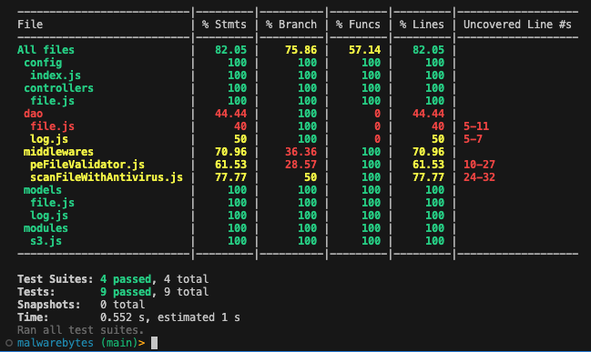

# Malwarebytes File Upload System

The Malwarebytes File Upload System is designed for the secure collection and management of Portable Executable (PE) files from various clients, with a focus on validating file uniqueness and managing telemetry data for security and analysis purposes.

## Technology Stack

- Backend: Node.js with Express for server setup and routing.
- Database: MongoDB for storing file metadata and logs.
- File Storage: MinIO for private, secure cloud storage, compatible with AWS S3.
- Containerization: Docker and Docker Compose for container management and deployment.
- File Storage SDK: AWS S3 SDK, configured for compatibility with MinIO.
- Testing: Jest for unit testing.
- API Documentation: Swagger for detailed API documentation and testing interface.
- Security: Rate limiter middleware to prevent abuse of the API endpoints.

## Running the Project

### Cloning the Repository

Clone the Git repository:

```
git clone https://github.com/kburakf/malwarebytes.git
```

Change directory:

```
cd malwarebytes
```

### NPM

Install dependencies:

```
npm install
```

Start the server:

```
npm start
```

### Docker Compose

Build and run containers:

```
docker-compose up --build -d
```

This command sets up MongoDB, MinIO, and the application server, ensuring they are properly interconnected.

### API Documentation

Access the Swagger UI for detailed API documentation and testing at http://localhost:3000/api-docs.

Example API Call

- POST - http://localhost:3000/api/v1/files

Body: Include the PE file in the form data with the key file.

### Virus Scanning

The system incorporates ClamAV for scanning uploaded files to ensure they are free of malware.

### Rate Limiter Middleware

A rate limiter middleware is implemented to prevent abuse by limiting the number of requests a client can make in a given period of time. This helps to prevent denial-of-service attacks and ensures fair resource usage among clients.

### Test Coverage


